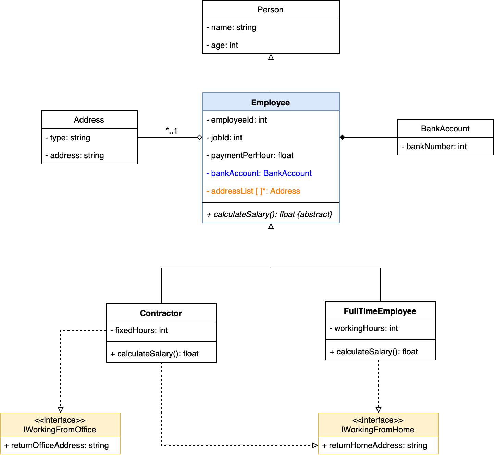

# Laboratorio #2 OOP
El siguiente laboratorio tiene como objetivo poner en práctica todos los conceptos del paradigma de programación orientado a objetos.

## Diagrama de UML

## Instrucciones
* Desarrollar los archivos correspondientes al diagrama de UML anterior
* Implementar el método `calculateSalary()` para `Contractor`: el cálculo es el resultado de la multiplicación de las horas fijas por el costo por hora. Y para `FullTimeEmployee` implementar el método `calculateSalary()`: el cálculo es el resultado de la multiplicación de las horas de trabajo por el costo por hora menos un 29% de impuestos.
* El método `returnHomeAddress()` simplemente retorna la dirección asociada al tipo `HOME`. Y `returnOfficeAddress` retorna la dirección asociada al tipo `OFFICE`.
* En este ejercicio, las pruebas de unidad ya existen en el folder `tst`, por lo tanto el objetivo es desarrollar el código necesario para que todas las pruebas de unidad corran. En total son dos test suites `ContractorTestSuite` y `FullTimeEmployeeTestSuite` con tres pruebas cada uno.
* NO TIENEN QUE MODIFICAR LAS PRUEBAS DE UNIDAD